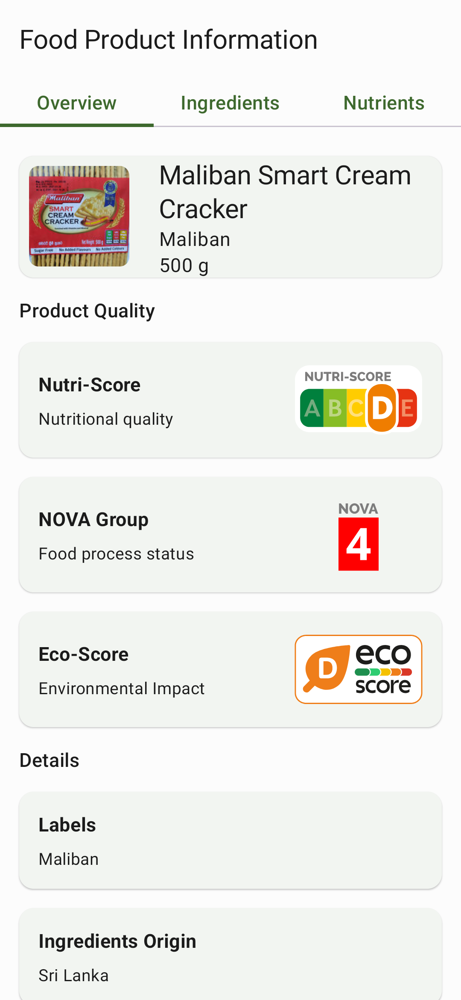
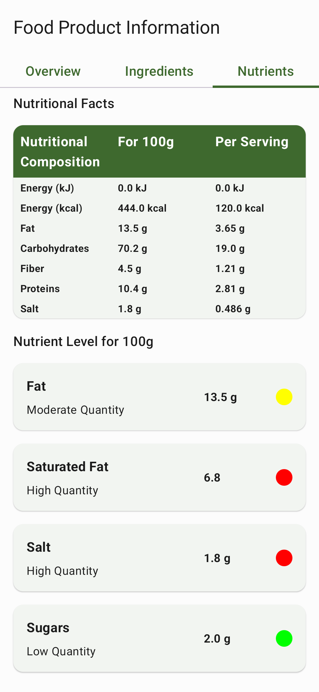
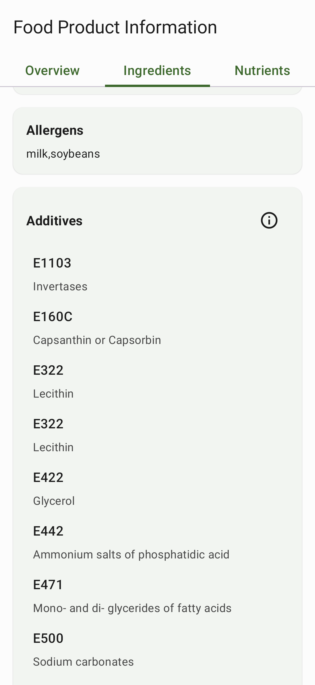

[English](README.md) | [日本語](README.ja-JP.md) | [Deutsch](README.de-DE.md) | [Русский](README.ru-RU.md) | [ଓଡ଼ିଆ](README.or-IN.md) | [සිංහල](README.si-LK.md)

  
  <h1 align="center">Food-E App</h1>
  <b>Food-E</b>は食品添加物データベースアプリです。
   各添加物に関する包括的な情報が含まれています。
   アプリは、<a href="https://github.com/SuhasDissa/E-Number-Database">E-Number-Databaseを使用しています</a>  

 

    
    
    
    
    
     

---

  
  スクリーンショット

  
  
  

  
  
  

  
  

## ✨ 特徴
- 560以上の食品添加物のコレクション
- 添加物名またはEナンバーで検索
- 各添加物の詳細
- 食品のバーコードをスキャンして栄養成分情報を取得します。
- アプリ内で食品を検索します。
- 複数の言語をサポート。
- 添加物情報の自動翻訳
- 大画面タブレットをサポート

## 📲 インストール

## 役立つリンク

## 貢献者向け

[Wikiはこちら](https://github.com/SuhasDissa/Food-E-App/wiki)
