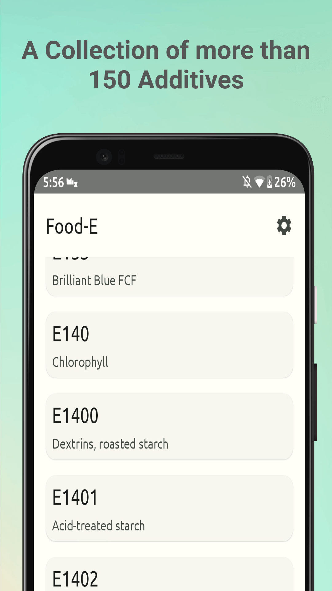
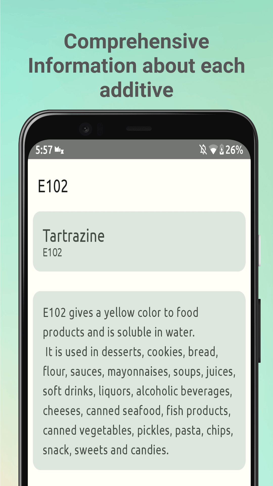

  
  <h1 align="center">Food-E App</h1>
  <b>Food-E</b> is a food additives database app

---

  
  

## Features
- A Collection of more than 150 Food Additives
- Search by additive name or E-number
- Detailed info about each additive

## Installation

