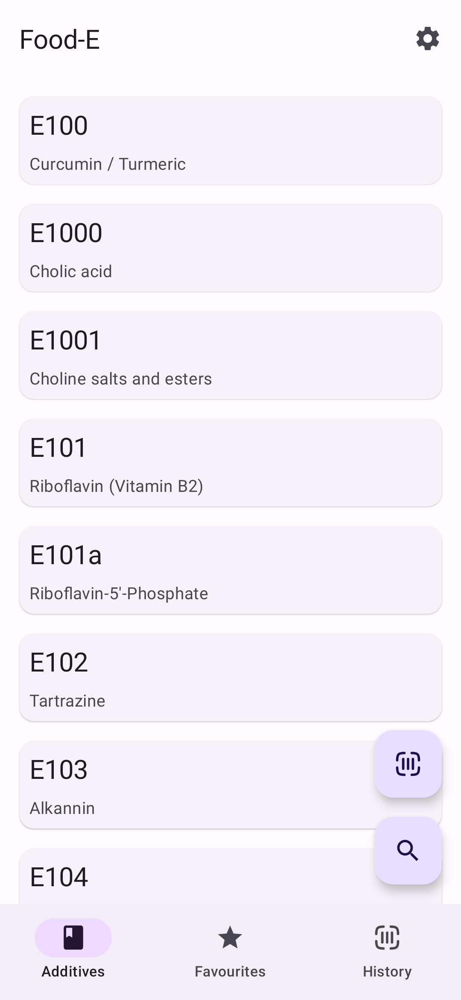
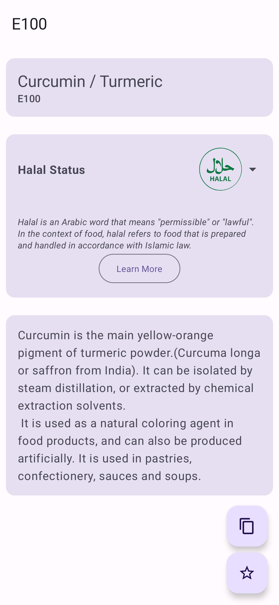
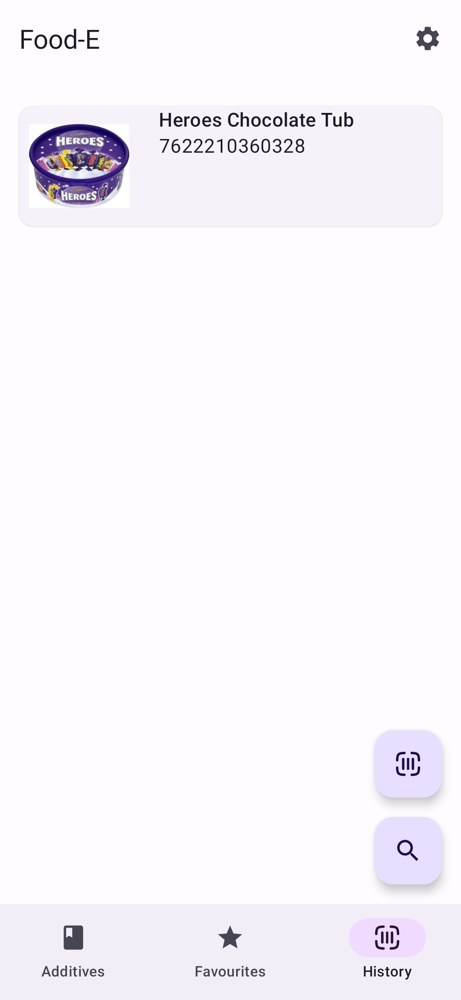

  
  <h1 align="center">Food-E App</h1>
  <b>Food-E</b> යනු ආහාර ආකලන දත්ත සමුදා යෙදුමකි.
  එක් එක් ආකලන පිළිබඳ සවිස්තරාත්මක තොරතුරු අඩංගු වේ.
  යෙදුම <a href="https://github.com/SuhasDissa/E-Number-Database">E-Number-Database</a> භාවිතා කරයි  

---

  
  Screenshots

  
  
  

  
  

## ✨ විශේෂාංග
- ආහාර ආකලන 150 කට වැඩි එකතුවක්
- ආකලන නම හෝ E-අංකය මගින් සොයන්න
- එක් එක් ආකලන පිළිබඳ සවිස්තරාත්මක තොරතුරු
- විශාල තිර ටැබ්ලට් සඳහා සහාය

## 📲 Installation

## ⭐ තරු ඉතිහාසය

## 🧾පරිවර්තනය
[Crowdin පරිවර්තනය](https://crowdin.com/project/food-e-app)

## දායකයින් සඳහා

[විකිය කියවන්න](https://github.com/SuhasDissa/Food-E-App/wiki)
